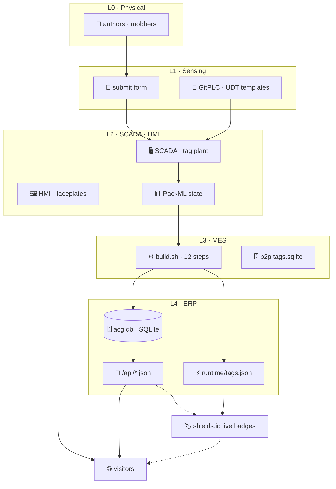

# ⚒ ACG · Guild HMI

*AI Craftspeople Guild — ISA-95 live control-plane · static JSON API · browser P2P mesh*

<a href="https://aicraftspeopleguild.github.io/"></a>
<a href="https://aicraftspeopleguild.github.io/aicraftspeopleguild-manifesto.html"></a>
<a href="https://aicraftspeopleguild.github.io/guild/Enterprise/L1/forms/submit/"></a>
<a href="https://aicraftspeopleguild.github.io/guild/apps/p2p/"></a>
<a href="https://aicraftspeopleguild.github.io/guild/Enterprise/"></a>

---

## ▣ STATUS BOARD

**`REPO`**  


**`CATALOG · health.json`**  


**`ENTERPRISE · L4 tags`**  


**`PIPELINE · L3`**  


**`IDENTITY · deploy`**  


---

## 📡 API

Static JSON rebuilt on every push · served from GitHub Pages · CORS open.

| endpoint | live |
|---|---|
| [`/guild/Enterprise/L4/api/health.json`](https://aicraftspeopleguild.github.io/guild/Enterprise/L4/api/health.json) |  |
| [`/guild/Enterprise/L4/api/papers.json`](https://aicraftspeopleguild.github.io/guild/Enterprise/L4/api/papers.json) |  |
| [`/guild/Enterprise/L4/api/members.json`](https://aicraftspeopleguild.github.io/guild/Enterprise/L4/api/members.json) |  |
| [`/guild/Enterprise/L4/runtime/tags.json`](https://aicraftspeopleguild.github.io/guild/Enterprise/L4/runtime/tags.json) |  |

```bash
curl https://aicraftspeopleguild.github.io/guild/Enterprise/L4/api/health.json
# → {"paperCount":24,"memberCount":8,"lastUpdated":"...","apiVersion":"1.0"}

curl https://aicraftspeopleguild.github.io/guild/Enterprise/L4/runtime/tags.json | jq '.enterprise'
# → live enterprise counters (papers · members · programs · runs · tagEdges)
```

---

## 🧬 ARCHITECTURE



---

## 🎛 CONTROLS

[](https://aicraftspeopleguild.github.io/guild/Enterprise/L1/forms/submit/)
[](https://github.com/aicraftspeopleguild/aicraftspeopleguild.github.io/issues/new/choose)
[](https://github.com/aicraftspeopleguild/aicraftspeopleguild.github.io/discussions)
[](https://aicraftspeopleguild.github.io/guild/apps/p2p/)

| page | |
|---|---|
| [`/`](https://aicraftspeopleguild.github.io/) | Guild landing |
| [`/guild/Enterprise/`](https://aicraftspeopleguild.github.io/guild/Enterprise/) | Enterprise controls · NESW dock |
| [`/guild/apps/p2p/`](https://aicraftspeopleguild.github.io/guild/apps/p2p/) | P2P mesh · WebRTC · WebTorrent |
| [`/guild/apps/whitepapers/`](https://aicraftspeopleguild.github.io/guild/apps/whitepapers/) | Paper reader |
| [`/guild/Enterprise/L2/scada/gateway/gateway-log.html`](https://aicraftspeopleguild.github.io/guild/Enterprise/L2/scada/gateway/gateway-log.html) | ⚠ live error log |
| [`/guild/Enterprise/L2/scada/gateway/health.html`](https://aicraftspeopleguild.github.io/guild/Enterprise/L2/scada/gateway/health.html) | ⚕ gateway health |
| [`/sitemap.xml`](https://aicraftspeopleguild.github.io/sitemap.xml) | full sitemap |

---

*[Discussions](https://github.com/aicraftspeopleguild/aicraftspeopleguild.github.io/discussions) · [Issues](https://github.com/aicraftspeopleguild/aicraftspeopleguild.github.io/issues) · [Engineering docs](docs/engineering/) · [Component catalog](docs/engineering/component-catalog/)*
3. **Every content change seeds through UDT instances.** Don't edit rendered HTML in `guild/web/dist/` — edit the UDT JSON under `guild/web/*/udts/instances/` and re-run the build.
4. **Follow the palette.** Parchment · ink · rust · bronze · graphite. Playfair Display + Work Sans. The component catalog encodes the contract.

---

## 📄 License

Content © 2026 AI Craftspeople Guild · MIT for code. The Guild welcomes reading, sharing, and thoughtful response. For reuse of written Guild content beyond fair use, please open an issue and ask — we usually say yes.

---

⚒ **Kindness, consideration, and respect.** ⚒

