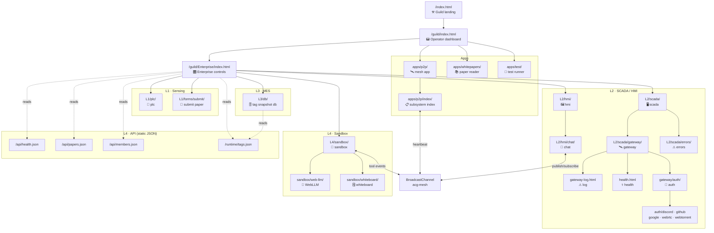

# ACG Screen Architecture · State Machines · Flow Map

*Generated 2026-04-18. Covers every `index.html` + utility HTML under `guild/`.*

---

## SCREEN INVENTORY

### Root / Guild

| screen | path | shell | status |
|---|---|---|---|
| Guild landing | `/index.html` | JSON-rendered SPA | ✅ |
| Guild operator dashboard | `/guild/index.html` | custom | ✅ |

---

### Enterprise Hub (L-root)

| screen | path | shell | notes |
|---|---|---|---|
| Enterprise controls landing | `guild/Enterprise/index.html` | `buildDockShell` + custom | ✅ ISA-95 level grid |
| ⭕ Enterprise status overview | *(missing)* | `renderSection` | overview of all L-levels in one view |

---

### L1 · Sensing

| screen | path | shell | notes |
|---|---|---|---|
| PLC / field interface | `L1/plc/index.html` | `renderSection` | UDTs + tags |
| Paper submit form | `L1/forms/submit/index.html` | standalone Google Form embed | ✅ |
| ⭕ Submit confirmation | *(missing)* | simple | post-submit receipt / status |
| ⭕ Tag write form | *(missing)* | `renderSection` | `.github/ISSUE_TEMPLATE/tag-update.yml` back-end; needs a UI front |

---

### L2 · SCADA / HMI

| screen | path | shell | notes |
|---|---|---|---|
| SCADA index | `L2/scada/index.html` | `renderSection` | ✅ |
| HMI index | `L2/hmi/index.html` | `renderSection` | ✅ |
| Chat | `L2/hmi/chat/index.html` | `buildDockShell` manual | ✅ full WebRTC P2P chat |
| Gateway index | `L2/scada/gateway/index.html` | `renderSection` | ✅ |
| Gateway log | `L2/scada/gateway/gateway-log.html` | standalone header | ✅ live localStorage ring-buffer table |
| Gateway health | `L2/scada/gateway/health.html` | standalone header | ✅ API endpoint probe table |
| Auth hub | `L2/scada/gateway/auth/index.html` | `renderSection` | ✅ |
| Auth · WebRTC | `auth/webrtc/index.html` | `renderSection` | ✅ |
| Auth · WebTorrent | `auth/webtorrent/index.html` | `renderSection` | ✅ |
| Auth · Discord | `auth/discord/index.html` | `renderSection` | ✅ |
| Auth · GitHub | `auth/github/index.html` | `renderSection` | ✅ |
| Auth · Google | `auth/google/index.html` | `renderSection` | ✅ |
| Errors viewer | `L2/scada/errors/index.html` | `renderSection` | ✅ |
| ⭕ PackML state viewer | *(missing)* | `renderSection` or standalone | `L2/state/sm-last.json` exists — no screen |
| ⭕ Tag plant live view | *(missing)* | `renderSection` | read `L2/scada/tags.json` live; show 🟢🟡🔴 table |
| ⭕ Log entry form | *(missing)* | `renderSection` | `.github/ISSUE_TEMPLATE/log-entry.yml` back-end; no UI |
| ⭕ Control action form | *(missing)* | `renderSection` | `.github/ISSUE_TEMPLATE/control-action.yml` back-end; no UI |

---

### L3 · MES / Database

| screen | path | shell | notes |
|---|---|---|---|
| DB / tag snapshot | `L3/db/index.html` | `buildDockShell` manual | ✅ live tag table |
| ⭕ Pipeline run list | *(missing)* | standalone or dock | `L2/logs/pipeline-list/` exists; no screen |
| ⭕ Pipeline state detail | *(missing)* | standalone | `L2/state/*.state.json` files exist; no viewer |
| ⭕ Build log viewer | *(missing)* | standalone | complement to gateway-log; build-step focused |

---

### L4 · ERP / Sandbox

| screen | path | shell | notes |
|---|---|---|---|
| Sandbox index | `L4/sandbox/index.html` | custom sb-topbar | ✅ card grid of tools |
| Whiteboard | `L4/sandbox/whiteboard/index.html` | custom | ✅ shared canvas over BroadcastChannel |
| WebLLM | `L4/sandbox/web-llm/index.html` | custom | ✅ in-browser LLM |
| ⭕ API explorer | *(missing)* | standalone | hit `/api/*.json` endpoints in-browser with live output |
| ⭕ Tag DB browser | *(missing)* | standalone | browse `acg.db` via `/api/` queries |
| ⭕ Members list | *(missing)* | `renderSection` or standalone | `/api/members.json` exists; no screen in Enterprise |
| ⭕ Papers list | *(missing)* | `renderSection` | `/api/papers.json` exists; no dedicated screen in Enterprise |
| ⭕ Sandbox · P2P demo | *(missing)* | sb-card | BroadcastChannel mesh visualiser / peer graph |

---

### Apps

| screen | path | shell | notes |
|---|---|---|---|
| P2P app landing | `apps/p2p/index.html` | standalone | ✅ |
| P2P subsystem index | `apps/p2p/index/index.html` | `buildDockShell` | ✅ |
| Whitepapers app | `apps/whitepapers/` | SPA | ✅ |
| ACG-Test runner | `apps/test/index.html` | standalone | ✅ |
| ⭕ Programs explorer | *(missing)* | `renderSection` | `L4/programs/instances/` exist; no screen |

---

## STATE MACHINES

### 1 · PackML build pipeline (`L2/state/`)

```
IDLE ──[trigger]──► STARTING
STARTING ──[init ok]──► EXECUTE
EXECUTE ──[all steps done]──► COMPLETING
COMPLETING ──► COMPLETE
EXECUTE ──[step fail]──► ABORTING
ABORTING ──► ABORTED
ABORTED ──[reset]──► IDLE
```

**Live state file:** `L2/state/sm-last.json` → `{"git:state":"RUNNING","git:state:last_tick_at":"..."}`  
**Step state files:** `L2/state/*.state.json` (one per build script, 8 total)  
**Missing screen:** PackML state viewer — would show current state + all step states as a Gantt-style row

---

### 2 · Auth provider state (`L2/scada/gateway/auth/`)

Each auth provider is a sub-state-machine:

```
UNAUTHENTICATED
   ├─[WebRTC peer-id]──► AUTHENTICATED.webrtc
   ├─[Discord OAuth]──► AUTHENTICATED.discord
   ├─[GitHub OAuth]──► AUTHENTICATED.github
   ├─[Google OAuth]──► AUTHENTICATED.google
   └─[WebTorrent]──► AUTHENTICATED.webtorrent
AUTHENTICATED.* ──[logout/expire]──► UNAUTHENTICATED
```

**Missing:** no unified auth status screen showing which providers are live/stale

---

### 3 · P2P mesh client state (`BroadcastChannel("acg-mesh")`)

```
OFFLINE
   └─[page opens]──► ANNOUNCING (publishes "page-open")
ANNOUNCING ──[heartbeat tick, 5 s]──► LIVE
LIVE ──[heartbeat tick]──► LIVE (cycle)
LIVE ──[no heartbeat 15 s]──► STALE (removed from liveClients Map)
LIVE ──[page close]──► OFFLINE (publishes "page-close")
```

**Painted by:** `paintClientsBar()` in `views.js`, refreshes every 1 s  
**Missing:** no dedicated mesh topology view (who-is-online across all subsystems)

---

### 4 · Tag quality state (per tag in `tags.json`)

```
uncertain ──[first value written]──► good
good ──[value stale > threshold]──► stale
good/stale ──[write fails / bad value]──► bad
bad/stale ──[fresh value written]──► good
```

**Visualised:** `qDot()` in `views.js` → 🟢 🟡 🔴 ⚪  
**Missing:** no alarm annunciator screen (stale/bad tag count, history)

---

## FLOW MAP



---

## GAP ANALYSIS · MISSING SCREENS

### Priority 1 — data already exists, just no screen

| missing screen | data source | effort |
|---|---|---|
| **PackML state viewer** | `L2/state/sm-last.json` + `*.state.json` | small — standalone HTML, poll + render |
| **Tag plant live view** | `L2/scada/tags.json` + mesh bridge | small — reuse `paintTags()` with live poll |
| **Pipeline run list** | `L2/logs/pipeline-list/` API endpoint | small — fetch + table |
| **Auth status panel** | provider `tags.json` files | small — aggregate provider quality |
| **Programs explorer** | `L4/programs/instances/` JSON | medium — list + detail view |
| **Members screen** | `/api/members.json` | small — card grid |
| **Papers screen** (Enterprise) | `/api/papers.json` | small — reuse paper-card component |

### Priority 2 — interaction gaps (forms exist as GitHub templates, no UI)

| missing screen | back-end | effort |
|---|---|---|
| **Tag write form** | `.github/ISSUE_TEMPLATE/tag-update.yml` | medium — form → GitHub issue POST |
| **Log entry form** | `.github/ISSUE_TEMPLATE/log-entry.yml` | small |
| **Control action form** | `.github/ISSUE_TEMPLATE/control-action.yml` | small |

### Priority 3 — observability / analytics

| missing screen | notes |
|---|---|
| **Alarm annunciator** | stale/bad tags, history, acknowledge |
| **Mesh topology view** | who is online across all subsystems (live peer graph) |
| **API explorer** | hit any `/api/` endpoint from browser, see live JSON |
| **Build log viewer** | build-step focused complement to `gateway-log.html` |
| **Submit confirmation** | post-submit receipt page after form |
| **Sandbox · P2P demo** | BroadcastChannel peer graph visualiser |
